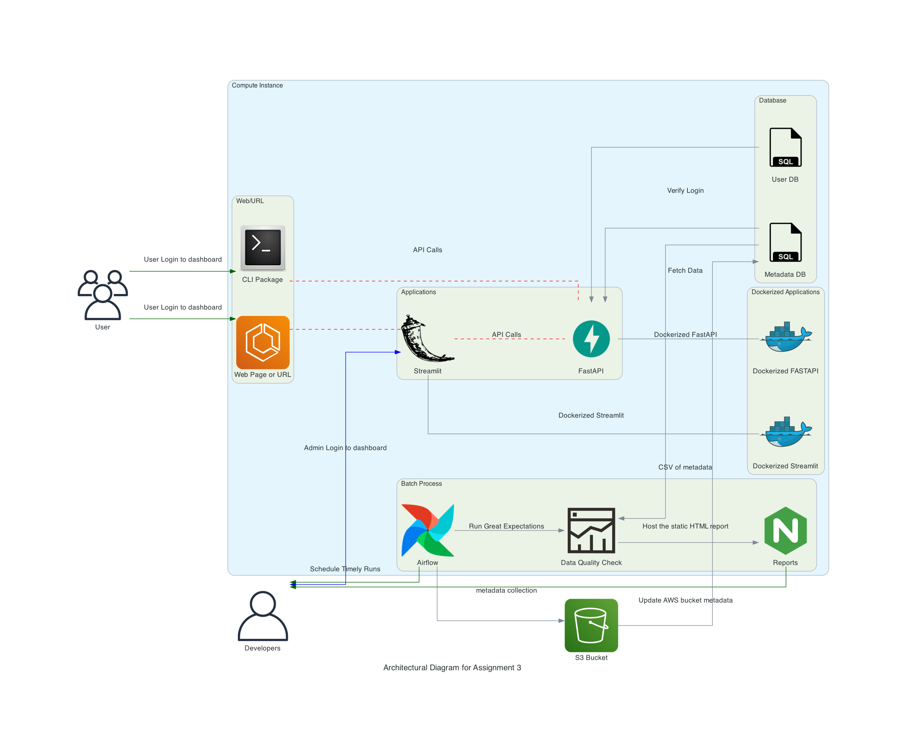

[](https://github.com/BigDataIA-Spring2023-Team-08/assignment03-data-as-a-service/actions/workflows/fastapi-test.yml)

# Assignment 03: Data as a Service

> ✅ Active status <br>
> [🚀 Application link](http://34.73.90.193:8076) <br>
> [🧑🏻‍💻 FastAPI](http://34.73.90.193:8002/docs) <br>
> [⏱ Airflow](http://34.73.90.193:9000) <br>
> [🎬 Codelab Slides](https://codelabs-preview.appspot.com/?file_id=1fUM2sqb3gwQnp8IVwKcPGf0Ss6CL-etq_i4HioGG4k4#12) <br>
> 🐳 Docker Hub Images: [FastAPI](https://hub.docker.com/repository/docker/mashruwalav/daas_api_v2/general), [Streamlit](https://hub.docker.com/repository/docker/mashruwalav/daas_streamlit_v2/general)

----- 

## Index
  - [Objective](#objective)
  - [Abstract 📝](#abstract)
  - [Architecture Diagram](#architecture-diagram)
  - [Project Components 💽](#project-components)
  - [FastAPI](#fast-api)
  - [Streamlit](#streamlit) 
  - [Unit Testing ⚒️](#unit-testing)
  - [Steps to run application](#steps-to-run-application)


## Objective
Providing Data as a Service of a Data Exploration Tool for Satellite Imagery Data (NOAA's NexRad and GOES Satellite). Construct a decoupled application with microservices of FastAPI and Streamlit, both published as an image on Docker Hub. Use docker compose to host both services and run live for users to access. 


## Abstract
The task involves decoupling the client and server from our data exploration tool and to host a private streamlit client
This work can help one: 

- Access the publicly available SEVIR satellite radar data in a highly interactive & quick way
- Scrap the data from public AWS S3 buckets to store them into a personal S3 bucket making it convenient to then perform additional tasks or use these saved files from your personal bucket. Government’s public data can always be hard to navigate across but we make it easy with our application
- Get files through the application by 2 options: searching by fields or directly entering a filename to get the URL from the source
- View the map plot of all the NEXRAD satellite locations in the USA
- Access the application through CLI which is available in the form of a python package

## Architecture Diagram
This architecture diagram depicts the flow of the application and the relationships between services. NOTE: Our proposed diagram is same our final implemented framework




## Project Components
- FastAPI: REST API endpoints for the application
- Streamlit: Frontend interface for the Data as a Service application
- Airflow: DAG to scrape & load metadata every midnight into a S3 bucket. Second DAG to perform data quality check of the metadata scraped using Great Expectations
- Docker images: Both FastAPI and Streamlit images have been put on Docker Hub. These images have been pulled using the [docker-compose.yml](docker-compose.yml) and the application is deployed through GCP live on URL specified above


## Fast API
To truly ensure decoupling, API calls are made in the backend to the Streamlit app in order to achieve the following:

- Create and Get users : Users are created with their name, username, password(stored as a hash) and Plan
- Plan: The users are offered 3 plans: Free, Gold and Platinum with varying levels of API request limits.
- Query the DB to populate the Search fields in Streamlit
- Create and verify Login and Access Tokens,
- Allow download of files

The users in the database are granted an access token for a limited time, also known as a session. This access token acts as an authentication to facilitate authorization.

create JWTToken.py file, here we make use of a secret key, an algorithm of our choice(HS256) and an expiration time(30 mins)
This function contains 2 functions:
  - Function to generate an access token
  - Function to verify the access token
  
### Create a docker image for this FastAPI app:

```
docker build -t daas_api_v2:latest .
docker tag daas_api_v2:latest mashruwalav/daas_api_v2:latest
docker push mashruwalav/daas_api_v2:latest
```

## Streamlit
The data exploration tool for the Geospatial startup uses the Python library [Streamlit](https://streamlit.iohttps://streamlit.io) for its user interface. The tool offers a user-friendly experience with three distinct pages, each dedicated to NexRad, GOES, and NexRad location maps. On each page, users can choose between downloading satellite data based on filename or specific field criteria. The UI then displays a download link to the S3 bucket, enabling users to successfully retrieve the desired satellite images.

### Streamlit UI layout:

  - Login/ Signup Functionality
    - Login page for returning users to enter username and password to get access to the data exploration application
    - Signup page for new users to enter name, username, password and confirm password to access the application
  - Logout
    - Logout users to end session and return to Login/ Signup page
  - GOES18 data downloader page
      - Download file by entering field values
      - Get public URL by entering filename
  - NEXRAD data downloaded page
      - Download file by entering field values
      - Get public URL by entering filename
  - NEXRAD Maps Location page
  - Pop up to suggest a plan upgrade when the users exceed their alloted number of API request limits
  - Analytics Dashboard
      - Plotting a line chart of count of request by each user against time (date)
      - Metric for total API calls the previous day
      - Metric to show total average calls during the last week
      - Comparison of Success (200 response code) and Failed request calls(ie non 200 response codes)
      - Each endpoint total number of calls

### Create a docker image for this FastAPI app:

```
docker build -t daas_streamlit_v2:latest .
docker tag daas_streamlit_v2:latest mashruwalav/daas_streamlit_v2:latest
docker push mashruwalav/daas_streamlit_v2:latest
```

## Unit Testing
[PyTest](https://docs.pytest.org/en/7.1.x/contents.html) framework implemented to write tests which is easy to use but can be scaled to support functional testing for applications and libraries.
* Create a new file [test_main.py](test_main.py), containing test functions
* Implemented testing functions for all API endpoints. The tests have also been integrated to git actions and run on every commit. The workflow is present at [fastapi-test.yml](.github/workflows/fastapi-test.yml)

## Steps to run application
1. Download app files
2. Have a ```.env``` file with necessary AWS credentials
3. Execute the [docker compose file](docker-compose.yml) to have the FastAPI and Streamlit images running simultaneously by executing the following command: 
```
docker compose up
```

This runs the application with a frontend streaml interface on [http://34.73.90.193:8076](http://34.73.90.193:8076)
-----
> WE ATTEST THAT WE HAVEN’T USED ANY OTHER STUDENTS’ WORK IN OUR ASSIGNMENT AND ABIDE BY THE POLICIES LISTED IN THE STUDENT HANDBOOK.
> 
> Vraj: 25%, Poojitha: 25%, Merwin: 25%, Anushka: 25%
-----


[//]: # (These are reference links used in the body of this note and get stripped out when the markdown processor does its job. There is no need to format nicely because it shouldn't be seen. Thanks SO - http://stackoverflow.com/questions/4823468/store-comments-in-markdown-syntax)

